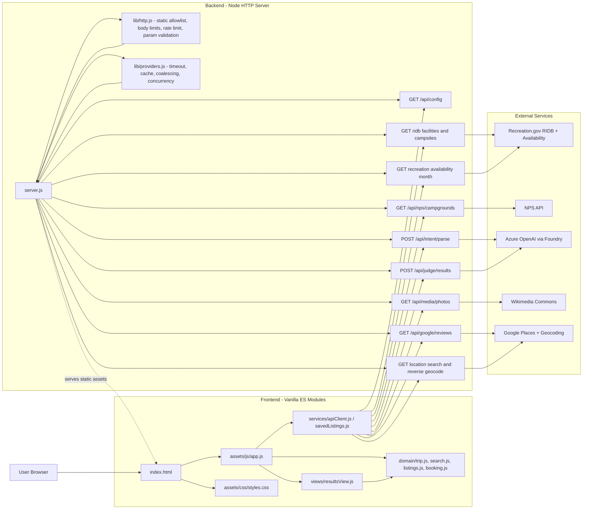

# Campin Architecture

This diagram shows the high-level architecture for the Campin application: the browser app, the local Node proxy server (with its helper modules), and the external data providers.

Notes:

- The browser only talks to same-origin `/api` routes; provider keys stay in the server process.
- `lib/providers.js` wraps every upstream fetch with a timeout, in-memory TTL cache, request coalescing, and a concurrency cap, so provider outages degrade instead of cascading.
- `lib/http.js` rejects non-allowlisted static paths, caps JSON bodies, rate limits clients, and validates query parameters before any provider work happens.
- Availability is requested per month of the requested stay and intersected per campsite across all nights; the resulting state (`not_checked`, `checking`, `unknown`, `available`, `unavailable`) is computed in `assets/js/domain/trip.js`.
