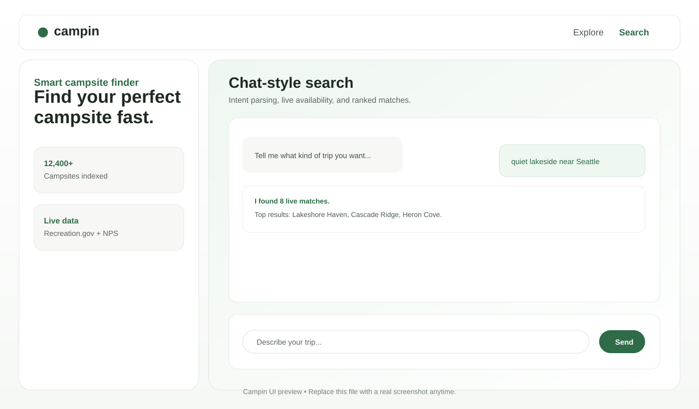

# Campin

Campin is an AI-assisted campsite finder with live inventory, intent-aware ranking, and detail pages enriched with provider and Google review data.


---

## Table of Contents

- [Features](#features)
- [Screenshot](#screenshot)
- [Quick Start](#quick-start)
- [Usage](#usage)
- [Providers](#providers)
- [Environment Variables](#environment-variables)
- [API Endpoints](#api-endpoints)
- [Dependencies](#dependencies)
- [Project Structure](#project-structure)
- [Fallback Behavior](#fallback-behavior)
- [Troubleshooting](#troubleshooting)
- [Security Notes](#security-notes)
- [Verification](#verification)
- [Intent Quality Baseline](#intent-quality-baseline)
- [Contributing](#contributing)

## Features

- Chat-style natural language search with fixed-size, scrollable conversation UI
- Explore page for inspiration based on top-reviewed campgrounds across the United States
- Search results with strict location and intent filtering, plus relevance top-up when needed
- LLM intent parser and LLM-as-judge validation layer for result quality control
- Live availability signals from Recreation.gov inventory endpoints
- Campground detail views with dynamic summaries, media hydration, and Google review cards
- Local API proxy architecture to keep provider keys server-side and avoid browser CORS issues

## Screenshot



Home and results views with chat-style search, live provider signals, and intent-aware ranking.

## Quick Start

### Prerequisites

- Node.js 18+

### Install and Run

- Create a local environment file.

macOS/Linux:

```bash
cp .env.example .env
```

Windows PowerShell:

```powershell
Copy-Item .env.example .env
```

- Fill in required values in .env.
- Start the app.

```bash
npm start
```

- Open <http://localhost:5500>.

## Usage

### Main Flow

1. Open Search and ask for what you want, for example: quiet dog-friendly campground near Seattle.
2. Campin parses intent, pulls live provider data, and ranks candidates.
3. Open a result card to view details, availability notes, photos, and Google review snippets.

### Explore Flow

1. Open Explore.
2. Browse inspiration cards by region filters.
3. Open any listing to continue in the same detail experience.

## Providers

| Provider | Purpose in Campin | Route(s) |
| --- | --- | --- |
| Recreation.gov RIDB | Facility/campground discovery | `GET /api/ridb/facilities` |
| Recreation.gov Availability | Month-level live inventory signals | `GET /api/recreation/availability/:campgroundId/month` |
| National Park Service (NPS) | Additional campground discovery data | `GET /api/nps/campgrounds` |
| Google Places | Review and rating hydration on detail pages | `GET /api/google/reviews` |
| Wikimedia Commons | Fallback photos when listing media is sparse | `GET /api/media/photos` |

## Environment Variables

Required for live providers:

- REC_API_KEY: Recreation.gov RIDB key
- NPS_API_KEY: National Park Service API key
- GOOGLE_PLACES_API_KEY: Google Places key for live review hydration

Required for Foundry AI features:

- FOUNDRY_ENDPOINT: Azure OpenAI resource URL
- FOUNDRY_API_KEY: Azure OpenAI key
- FOUNDRY_MODEL_DEPLOYMENT: deployed model name

Optional:

- FOUNDRY_API_VERSION: defaults to 2024-10-21
- DEMO_MODE: true enables mock fallback when live providers return no results
- PORT: server port (default 5500)

## API Endpoints

### Config and AI

- GET /api/config
- POST /api/intent/parse
- POST /api/judge/results

### Provider Proxies

- GET /api/ridb/facilities
- GET /api/nps/campgrounds
- GET /api/recreation/availability/:campgroundId/month
- GET /api/google/reviews
- GET /api/media/photos

## Dependencies

Campin intentionally keeps package dependencies minimal.

### npm dependencies

- None declared in package.json dependencies or devDependencies

### Runtime dependencies

- Node.js 18+
- Node core modules used by the server:
  - http
  - fs
  - path

### External services

- Recreation.gov RIDB API
- Recreation.gov Availability API
- National Park Service Campgrounds API
- Microsoft Foundry (Azure OpenAI Chat Completions)
- Google Places API
- Wikimedia Commons API

### Design dependency

- Google Fonts in index.html:
  - Playfair Display
  - DM Sans

## Project Structure

- index.html: app shell and view containers
- server.js: static server plus API proxy/orchestration endpoints
- assets/css/styles.css: design system and layout styles
- assets/js/app.js: search, ranking, rendering, and detail hydration logic
- assets/js/services/apiClient.js: frontend API client wrapper
- scripts/eval-intent.js: offline intent quality harness
- .env.example: template for local configuration

## Fallback Behavior

- If Foundry is unavailable, intent parsing falls back safely
- If some provider calls fail, Campin still renders partial results when possible
- If strict filtering is too narrow, closest matches are added to keep the experience usable
- If listing media is sparse, fallback photos are hydrated into empty slots
- If Google reviews are unavailable, detail view shows provider fallback review messaging
- If DEMO_MODE=true and live search returns no results, mock data can be used

## Troubleshooting

- Server starts but API calls fail:
  - Confirm `.env` exists and required keys are populated.
  - Restart the Node process after any `.env` change.
- `GET /api/google/reviews` returns an error:
  - Verify `GOOGLE_PLACES_API_KEY` is valid and restricted correctly.
  - Ensure Places API is enabled in Google Cloud.
- Search relevance is off for explicit locations:
  - Re-test intent parsing endpoint and judge endpoint using the same query.
  - Check whether fallback mode is active due to upstream API failures.
- Empty results in live mode:
  - Verify `REC_API_KEY` and `NPS_API_KEY` are valid.
  - Set `DEMO_MODE=true` only for demo/offline behavior.

## Security Notes

- Never commit .env
- Keep provider/API keys server-side only
- Rotate any exposed keys immediately
- Use restricted keys (API restrictions and app/IP referrer restrictions)

## Verification

After startup, test the intent endpoint:

```bash
curl -X POST http://localhost:5500/api/intent/parse \
  -H "Content-Type: application/json" \
  -d '{"query":"quiet lakeside campsite near Seattle","context":{"dateSelection":"June 6-8","guestSelection":"2 guests","activePills":["dog-friendly"]}}'
```

Expected outcome: JSON payload includes intent.enabled and intent.source.

You can also test Google review proxy wiring:

```bash
curl "http://localhost:5500/api/google/reviews?query=seattle%20campground"
```

## Intent Quality Baseline

Campin includes an offline eval runner for intent extraction quality checks.

Run:

```bash
npm run eval:intent
```

Optional base URL override:

```bash
EVAL_BASE_URL=http://localhost:5500 npm run eval:intent
```

## Contributing

Contributions are welcome. For changes to search quality, provider integrations, or UI behavior:

- Open an issue describing the current behavior and desired outcome.
- Keep edits focused and include verification steps for API-facing changes.
- If you modify intent or ranking logic, run `npm run eval:intent` before opening a PR.
- Never commit secrets; use `.env.example` for new configuration keys.
