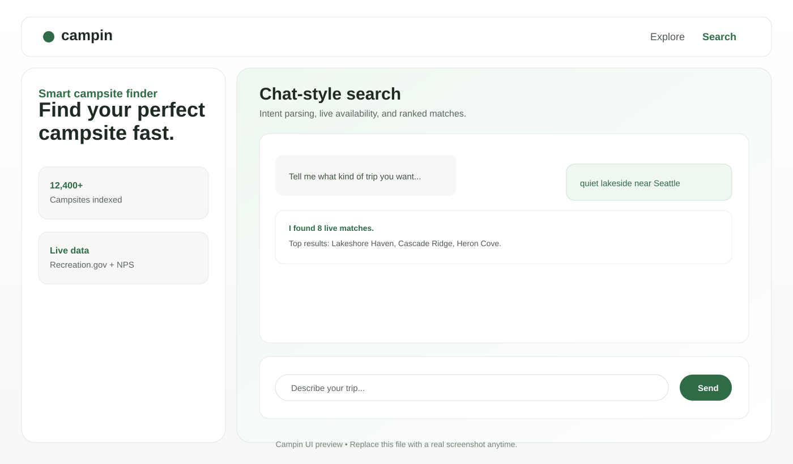

# Campin

Campin is a campsite search interface for real Recreation.gov (RIDB) and National Park Service campground data. A local Node proxy keeps provider keys server-side, intent parsing turns a free-text trip request into structured constraints, and availability is checked per requested night across the whole stay.


---

## Table of Contents

- [Features](#features)
- [Screenshot](#screenshot)
- [Quick Start](#quick-start)
- [Usage](#usage)
- [Providers](#providers)
- [Environment Variables](#environment-variables)
- [API Endpoints](#api-endpoints)
- [Scripts](#scripts)
- [Architecture](#architecture)
- [Testing](#testing)
- [Fallback Behavior](#fallback-behavior)
- [Known Limitations](#known-limitations)
- [Troubleshooting](#troubleshooting)
- [Security Notes](#security-notes)
- [Verification](#verification)
- [Intent Quality Baseline](#intent-quality-baseline)
- [Contributing](#contributing)

## Features

- Natural language trip requests parsed into structured intent (location, party size, constraints, priorities) with follow-up clarification questions when required details are missing
- Live campground discovery from Recreation.gov (RIDB) and NPS, plus RIDB campsite summaries for capacity and fee facts
- Availability checked for every requested night of the stay, including stays that span two months, on the same campsite
- Results split into "Verified campground requirements" and "Alternatives, requirements unmet or unverified", with the specific reason (for example `dogs allowed: not verified`)
- Explicit availability states: `not_checked`, `checking`, `unknown`, `available`, `unavailable`
- Detail views with provider-derived descriptions and amenities, provider photos, and optional Google review snippets
- Booking handoff that opens the real provider page (Recreation.gov, NPS, or the campground's own reservation URL) in a new tab
- Explore view that runs 20 destination queries across five U.S. regions, balances them into up to 30 cards, and enriches each Recreation.gov card with provider campsite data (price, tent/RV, capacity) when available
- Saved listings kept in `localStorage`
- Local API proxy so provider keys never reach the browser

Campin does not invent data. Prices, ratings, capacities, and reviews are only shown when a provider actually returned them; otherwise the field is rendered as unavailable or "not verified". No reservations are submitted anywhere.

## Screenshot



Home and results views with chat-style search, live provider signals, and requirement grouping.

## Quick Start

### Prerequisites

- Node.js 18 or newer (CI runs Node 22)

### Install and Run

- Install dependencies.

```bash
npm install
```

- Create a local environment file.

macOS/Linux:

```bash
cp .env.example .env
```

Windows PowerShell:

```powershell
Copy-Item .env.example .env
```

- Fill in the values you have in `.env`. `REC_API_KEY` and `NPS_API_KEY` are what produce live campground results; without them those proxy routes return 503 and the app reports a provider error instead of mock data. Recreation.gov availability needs no key, Google reviews/geocoding need `GOOGLE_PLACES_API_KEY`, and AI intent parsing needs the `FOUNDRY_*` keys.
- Start the app.

```bash
npm start
```

- Open <http://localhost:5500>. The server binds `127.0.0.1` on `PORT` (default 5500).

## Usage

### Search Flow

1. Open Search and describe the trip, for example: `quiet dog-friendly campground near Seattle for 2 guests`.
2. Dates can be typed in the check-in/check-out fields or mentioned in the request ("this weekend"); stays can be up to 30 nights.
3. Campin parses intent, asks clarifying questions if location, party size, or priorities are missing, then queries Recreation.gov and NPS and checks availability for the full stay.
4. Results are grouped by whether the trip requirements are verified, then ordered inside each group by composite relevance: query-term overlap with the listing, priority-word matches, distance decay, stay availability, and campsite-verified tent/RV amenities. Location searches combine a geo query with keyword queries, and thin areas widen the radius (50 to 150 to 400 km); the results header shows the radius actually searched. Open a result card for details, availability notes, photos, and review snippets.
5. "Book on Recreation.gov" / booking CTAs open the provider page in a new tab with your dates prefilled. Campin never submits a reservation.

### Explore Flow

1. Open Explore.
2. Browse up to 30 campground listings balanced across regions (All U.S., West, Rockies, South, Midwest, Northeast). Recreation.gov cards show provider campsite data (minimum listed price, tent/RV suitability, capacity) when the provider returns it.
3. Open any listing to continue in the same detail experience.

### Availability

Availability is only requested when a stay is set. Each night of the stay is matched against Recreation.gov availability for the campground, so a result is `available` only when one campsite is open for every night, `unavailable` when the data is complete but nothing fits, and `unknown` when the provider data is incomplete or could not be read. Changing dates clears previous availability instead of reusing stale results.

## Providers

| Provider | Purpose in Campin | Route(s) |
| --- | --- | --- |
| Recreation.gov RIDB | Facility discovery and campsite facts | `GET /api/ridb/facilities`, `GET /api/ridb/facilities/:facilityId/campsites` |
| Recreation.gov Availability | Per-night campsite availability for a stay | `GET /api/recreation/availability/:campgroundId/month` |
| National Park Service (NPS) | Additional campground discovery data | `GET /api/nps/campgrounds` |
| Google Places | Optional review/rating hydration and geocoding | `GET /api/google/reviews`, `GET /api/location/search`, `GET /api/location/reverse` |
| Wikimedia Commons | Illustrative photos when a listing has no usable image | `GET /api/media/photos` |

## Environment Variables

Read from `.env` (or the process environment; existing environment variables win over `.env`).

Required for Recreation.gov / RIDB data:

- `REC_API_KEY`

Required for NPS data:

- `NPS_API_KEY`

Required for Google reviews, reverse geocoding, and location lookups:

- `GOOGLE_PLACES_API_KEY`

Required for AI intent parsing (`POST /api/intent/parse`):

- `FOUNDRY_ENDPOINT` (Azure OpenAI resource URL)
- `FOUNDRY_API_KEY`
- `FOUNDRY_MODEL_DEPLOYMENT`

Optional:

- `FOUNDRY_API_VERSION` (defaults to `2024-10-21`)
- `DEMO_MODE` (truthy values `1`, `true`, `yes`, `on`; only then may mock listings be shown, and they are clearly labelled and not bookable)
- `PORT` (defaults to `5500`; the server always binds `127.0.0.1`)

Recreation.gov availability needs no key, but only works for campgrounds whose Recreation.gov campground ID can be resolved.

## API Endpoints

All endpoints are served by the local Node server under `/api` and are rate limited.

### Config and AI

- `GET /api/config` – returns `{ demoMode }`
- `POST /api/intent/parse` – structured trip intent from `{ query, context }`; falls back to `source: "fallback"` when Foundry is not configured or unparseable
- `POST /api/judge/results` – LLM result judging for up to 8 candidate cards

### Provider Proxies

- `GET /api/ridb/facilities?query=&limit=&latitude=&longitude=&radius=`
- `GET /api/ridb/facilities/:facilityId/campsites?limit=&offset=`
- `GET /api/nps/campgrounds?q=&limit=`
- `GET /api/recreation/availability/:campgroundId/month?start_date=` (month start, `YYYY-MM-01T00:00:00.000Z`)
- `GET /api/google/reviews?query=`
- `GET /api/media/photos?query=`
- `GET /api/location/search?query=`
- `GET /api/location/reverse?lat=&lon=`

## Scripts

| Script | Command | What it does |
| --- | --- | --- |
| `npm start` | `node server.js` | Starts the static + proxy server on `127.0.0.1:5500` (`PORT` overrides) |
| `npm test` | `node --test tests/*.test.js` | Runs the `node:test` unit suites (`tests/server.test.js`, `tests/domain.test.js`) |
| `npm run check` | `node scripts/check-syntax.js` | `node --check`s every `.js` file in the repo except `.git`, `node_modules`, `test-results`, `playwright-report` |
| `npm run test:browser` | `playwright test` | Runs the Playwright suite in `tests/browser` against the fixture server |
| `npm run eval:intent` | `node scripts/eval-intent.js` | Scores intent parsing against `evals/intent-cases.json` using a running server |

## Architecture

`ARCHITECTURE.md` (and the matching `ARCHITECTURE.mmd`) contains the diagram. In short:

### Server

`server.js` is a dependency-free `node:http` server that serves a small static allowlist (`/index.html`, `/assets/demo-screenshot.svg`, and CSS/JS under `/assets/css/` and `/assets/js/`) and proxies provider traffic. Hardening lives in `lib/http.js` and `lib/providers.js`:

- static allowlist with path traversal rejection (`publicFile`)
- JSON body limit and strict shape validation (`readJsonBody`, 32 KB default)
- per-client rate limiting (`createRateLimiter`), plus a tighter limit for the AI endpoints
- query parameter validation (`validateApiParams`: limits, coordinate ranges, radius, month starts)
- provider fetch timeout, in-memory TTL cache, request coalescing, and concurrency limit (`createProviderFetcher`)
- sanitized JSON errors (`{ error }` payloads, no upstream detail leaked) and security headers including CSP, `X-Frame-Options`, and `Referrer-Policy` on every response

### Frontend

`index.html` is the app shell (home/search, explore, results, detail views). `assets/js/app.js` wires views to the API client and owns app state. Shared logic is split into ES modules:

- `assets/js/domain/trip.js` – ISO date validation, night/month expansion, availability summarization and labels
- `assets/js/domain/search.js` – distance, requirement evaluation (`exact` vs `near`), composite relevance scoring and query tokenization, radius schedule, regex fallback intent, search session/cancellation
- `assets/js/domain/explore.js` – Explore destination plan (20 queries, four per U.S. region) and region state lists
- `assets/js/domain/listings.js` – provider record normalization, price/occupancy extraction, campsite summaries that never invent values
- `assets/js/domain/booking.js` – booking cost breakdown (no invented fees)
- `assets/js/services/apiClient.js` – thin fetch wrapper for the `/api` routes with 12s request timeout
- `assets/js/services/savedListings.js` – `localStorage`-backed saved listing IDs
- `assets/js/views/resultsView.js` – results grid rendering, requirement grouping, save button state

`assets/js/package.json` only marks the directory as ESM (`"type": "module"`) so the browser modules and the unit tests can import it directly.

### Availability State Model

`trip.js` produces one of `not_checked`, `checking`, `unknown`, `available`, `unavailable`. `available`/`unavailable` require complete provider data for every night; anything partial becomes `unknown`. Demo listings report "Demo listing, not live inventory".

## Testing

- Unit tests (`npm test`) use the built-in `node:test` runner and need no network. `tests/server.test.js` covers the static allowlist, malformed URLs, body/param validation, rate limiting, and provider caching/timeout/concurrency; `tests/domain.test.js` covers trip validation, cross-month availability, DST boundaries, provider normalization, booking math, requirement grouping, search cancellation, and saved listings.
- `npm run check` is a fast syntax pass over the whole repo and runs before the test suites in CI.
- `tests/fixture-server.js` serves deterministic `/api` responses (a fixture campground plus destination-keyed explore fixtures, full-availability months, disabled reviews) and delegates non-API requests to the real server, so browser tests never hit live providers. It listens on `127.0.0.1:5502` by default (`PORT` overrides).
- Browser tests (`npm run test:browser`) run the Playwright suite in `tests/browser/core.spec.js`; `playwright.config.js` starts its own fixture server on port 5510 with a single worker. Install the browser once with `npx playwright install chromium` (CI uses `--with-deps chromium`). The suite launches its own standalone headless Chromium and never attaches to a shared desktop browser; `PW_USE_CDP=1` with `AGENT_BROWSER_CDP` is an opt-in escape hatch that runs against a CDP endpoint using a fresh isolated context.

CI (`.github/workflows/test.yml`) runs on every push and pull request on Node 22: `npm ci`, `npm run check`, `npm test`, `npx playwright install --with-deps chromium`, `npm run test:browser`.

## Fallback Behavior

- If Foundry is unavailable or returns invalid JSON, `/api/intent/parse` responds with `enabled: false, source: "fallback"`, and the browser falls back to its own regex intent parser
- If one provider fails, results from the other provider are still used; if both fail, the search reports an error with a retry action instead of showing mock data
- If a hard requirement cannot be verified (missing price, no capacity data, no geocoded origin), the card is kept but grouped under "Alternatives, requirements unmet or unverified" with the reason
- If listing media is sparse, illustrative Wikimedia Commons photos are offered instead; if Google reviews are unavailable, the detail view says so
- If Demo mode is on and live search returns nothing, clearly labelled, non-bookable demo listings are used

## Known Limitations

- Without the AI key, intent parsing falls back to regex heuristics; quality and coverage are lower
- Availability is only checked for campgrounds with a resolvable Recreation.gov campground ID; NPS listings without one stay "Availability could not be verified"
- Location search, reverse geocoding, and therefore distance filtering require the Google Maps/Places key; without it proximity is not verified and results are treated as alternatives
- RIDB campsite fees and occupancy are only used when the provider returns them; NPS pricing and capacity are frequently absent, so those fields show as not verified
- `POST /api/judge/results` is implemented and rate limited, but the current frontend does not call it
- Everything is a prototype: no accounts, no payments, and no reservations are ever submitted

## Troubleshooting

- Server starts but API calls fail:
  - Confirm `.env` exists and the keys you need are populated.
  - Restart the Node process after any `.env` change.
- `GET /api/ridb/facilities` or `GET /api/nps/campgrounds` returns 503:
  - The server is reporting a missing `REC_API_KEY` or `NPS_API_KEY`.
  - If they are set, the provider itself is the problem; check the RIDB/NPS developer portal for key status.
- `GET /api/google/reviews` or `GET /api/location/*` returns 503/disabled:
  - `GOOGLE_PLACES_API_KEY` is missing or invalid; ensure the Places and Geocoding APIs are enabled for that key.
- Search relevance is off for explicit locations:
  - Check whether intent parsing fell back (`source: "fallback"`) and whether geocoding returned an origin; without an origin, distance requirements cannot be verified.
  - Sparse areas widen the search radius automatically (50 to 150 to 400 km) before returning nothing; the header states the radius that was used.
- Empty results in live mode:
  - Verify provider keys, then try a broader query.
  - Set `DEMO_MODE=true` only for demo/offline behavior; demo cards are labelled and cannot be booked.

## Security Notes

- Never commit `.env`
- Keep provider/API keys server-side only; the browser talks only to `/api` on the same origin
- Rotate any exposed keys immediately
- Use restricted keys (API restrictions and app/IP referrer restrictions)

## Verification

After startup, test the intent endpoint:

```bash
curl -X POST http://localhost:5500/api/intent/parse \
  -H "Content-Type: application/json" \
  -d '{"query":"quiet lakeside campsite near Seattle","context":{"dateSelection":"June 6-8","guestSelection":"2 guests","activePills":["dog-friendly"]}}'
```

Expected outcome: JSON payload includes `intent.enabled` and `intent.source` (`foundry` when configured, otherwise `fallback`).

Check the config and a provider proxy:

```bash
curl http://localhost:5500/api/config
curl "http://localhost:5500/api/ridb/facilities?query=seattle&limit=3"
```

Availability proxy for a known Recreation.gov campground (substitute a real campground ID, e.g. from a `/api/ridb/facilities` result), month start:

```bash
curl "http://localhost:5500/api/recreation/availability/123456/month?start_date=2026-06-01T00:00:00.000Z"
```

## Intent Quality Baseline

Campin includes an offline eval runner for intent extraction quality checks.

Run:

```bash
npm run eval:intent
```

Optional base URL override:

```bash
EVAL_BASE_URL=http://localhost:5500 npm run eval:intent
```

The runner validates intent responses from a running server against `evals/intent-cases.json`, so meaningful numbers require the Foundry keys to be configured.

## Contributing

Contributions are welcome. For changes to search quality, provider integrations, or UI behavior:

- Open an issue describing the current behavior and desired outcome.
- Keep edits focused and include verification steps for API-facing changes.
- If you modify intent or ranking logic, run `npm run eval:intent` before opening a PR.
- Never commit secrets; use `.env.example` for new configuration keys.
